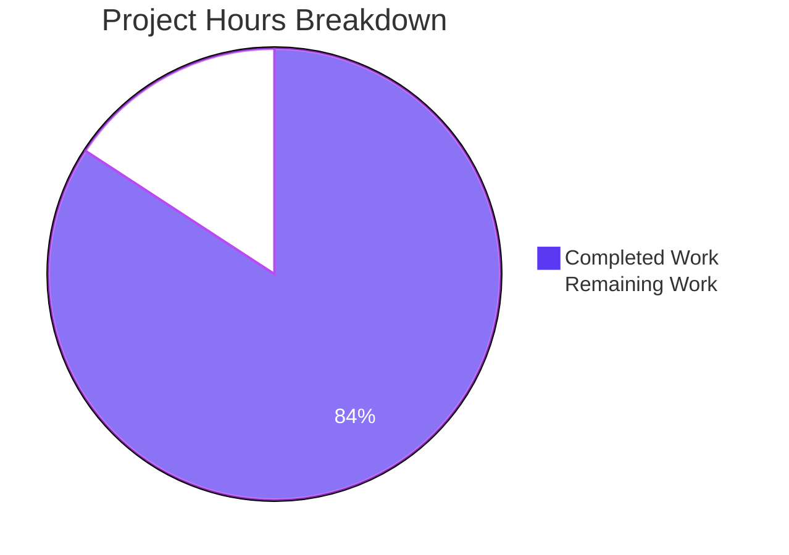
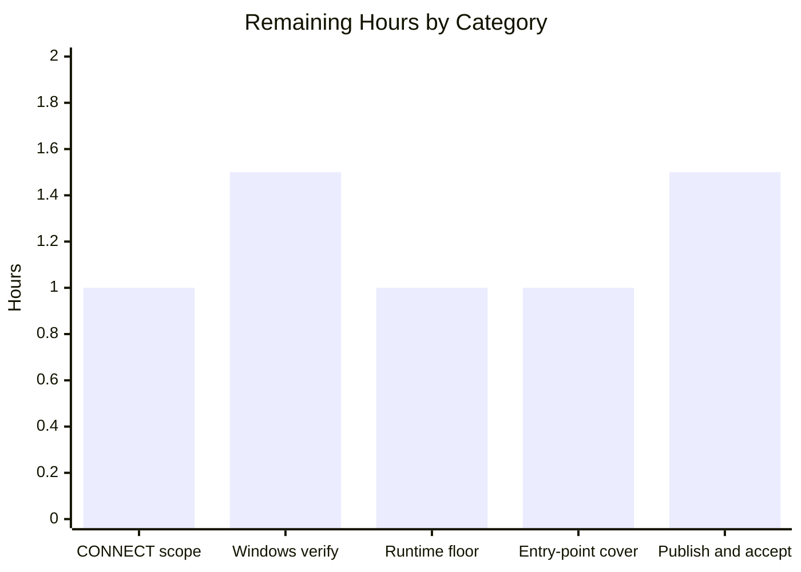
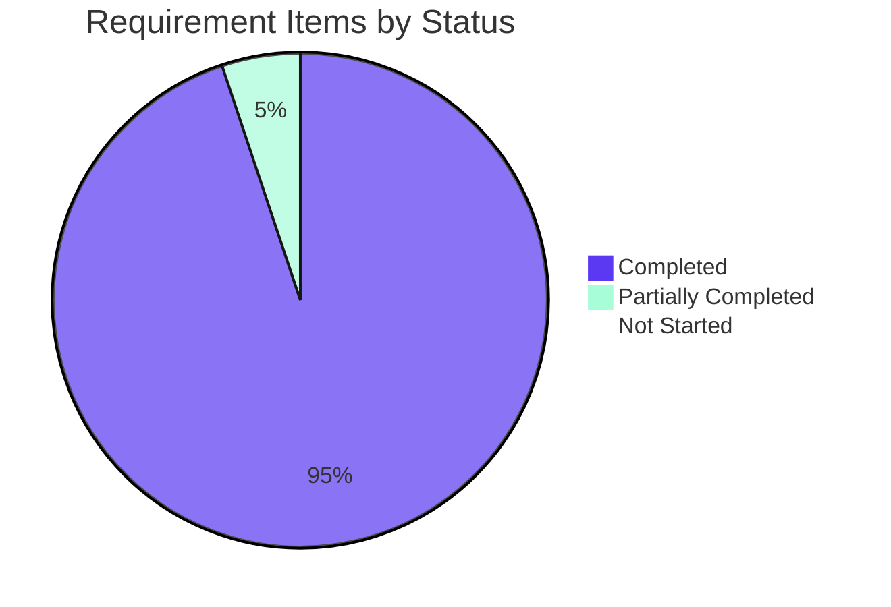

# 1. Executive Summary

## 1.1 Project Overview

`hello-world-node-tutorial` is a self-contained Node.js teaching repository: a single-process HTTP server exposing exactly one route, `GET /hello`, which returns the literal text `Hello world` to any HTTP client. Its audience is a developer new to Node.js, so readability is the primary quality attribute — the server is built on the core `node:http` module with zero dependencies, and every file is annotated for a first-time reader. It runs with one command after cloning, with no install step, configuration file or external service. Seven files make up the deliverable: three source modules, a test suite, a manifest, an ignore file and a teaching README.

## 1.2 Completion Status


Slice colours: Completed = Dark Blue `#5B39F3`, Remaining = White `#FFFFFF`.

| Metric | Value |
| --- | --- |
| Total Hours | 38.0 |
| Completed Hours (AI + Manual) | 32.0 (32.0 AI + 0.0 Manual) |
| Remaining Hours | 6.0 |
| Percent Complete | 84.2% |

Calculation: 32.0 ÷ 38.0 × 100 = **84.2%**.

## 1.3 Key Accomplishments

- ✅ `GET /hello` → `200`, `text/plain; charset=utf-8`, `Content-Length: 11`, body `Hello world` (11 bytes).
- ✅ `/hello/` is served as an alias; a query string is ignored.
- ✅ `HEAD /hello` returns the same status and headers with an empty body.
- ✅ Unserved paths answer `404`; other methods on `/hello` answer `405` with `Allow: GET, HEAD`.
- ✅ `npm start` runs from a fresh clone with no install step, logging the port it bound.
- ✅ An invalid or occupied `PORT` exits non-zero with one readable sentence, not a stack trace.
- ✅ `SIGINT` and `SIGTERM` both print `Server stopped` and release the port.
- ✅ Five automated tests assert the whole contract, with no test dependency or config file.

## 1.4 Critical Unresolved Issues

Four of the 39 tracked requirement items carry something still open. None blocks release; each is a decision or verification for the repository owner.

| Issue | Impact | Owner | ETA |
| --- | --- | --- | --- |
| The `405` contract is unqualified, but `CONNECT` is diverted by the runtime to its own event and receives no reply (`src/server.js:51`) | Low — `CONNECT` is a proxy verb and this service is not a proxy | Repository owner | 1.0h |
| The two Windows port-override forms and the Windows `SIGTERM` caveat rest on documentation, not observation (`README.md:144`) | Low — the POSIX form is verified; the other two are unexercised | Repository owner | 1.5h |
| `engines.node` is `">=24.0.0"`, which admits early 24.x builds predating later patches (`package.json:11`) | Medium — a reader may run an unpatched runtime | Repository owner | 1.0h |
| `src/index.js` has no automated regression guard for port resolution, bind failure or signals | Medium — all branches verified by hand, but a future edit is unguarded | Repository owner | 1.0h |

## 1.5 Access Issues

| System/Resource | Type of Access | Issue Description | Resolution Status | Owner |
| --- | --- | --- | --- | --- |
| Windows PowerShell 5.1 / `cmd` | Platform availability | The two Windows `PORT` override forms documented at `README.md:147` and `README.md:153` cannot be executed on a Linux host | Open — needs a Windows machine | Repository owner |

No credential, API key or service endpoint is needed anywhere in this project. No other access issue was identified.

## 1.6 Recommended Next Steps

1. **[High]** Settle whether the `405` rule covers `CONNECT` — likely a wording amendment, no code (1.0h).
2. **[Medium]** Run the PowerShell and `cmd` override forms on Windows (1.5h).
3. **[Medium]** Review whether `engines.node` should name a patched 24.x minimum (1.0h).
4. **[Medium]** Decide the entry point's regression cover and record its manual runbook (1.0h).
5. **[Low]** Publish, re-verify from a fresh clone, and have a newcomer work the README end to end (1.5h).

# 2. Project Hours Breakdown

## 2.1 Completed Work Detail

| Component | Hours | Description |
| --- | --- | --- |
| Project scaffolding, manifest and repository hygiene | 1.5 | `package.json` declaring `"type": "module"`, `main`, the `start` and `test` scripts, the `engines` floor and — deliberately — no dependency blocks at all; `.gitignore` excluding `node_modules/`, npm debug logs and `package-lock.json`, each with a one-line rationale for the reader. |
| Endpoint response handler (`src/hello.js`) | 2.0 | The `HELLO_BODY` constant and `handleHello(req, res)`: status `200`, `Content-Type: text/plain; charset=utf-8` and an explicit `Content-Length` computed from the body, so the response framing is deterministic rather than chunked. |
| Server factory and request dispatcher (`src/server.js`) | 5.5 | `createHelloServer()` returning a configured but non-listening `http.Server`; pathname derivation that tolerates both request-target forms without letting a client choose the path; path-before-method dispatch; and byte-exact `404` and `405` replies with `Allow: GET, HEAD`. |
| Process entry point and lifecycle (`src/index.js`) | 5.0 | `PORT` resolution with a `3000` default and a whole-number range check applied before binding, a fixed loopback host, one startup line naming the port actually bound, bind-failure reporting with a non-zero exit, and graceful shutdown on `SIGINT` and `SIGTERM`. |
| Automated contract test suite (`test/hello.test.js`) | 3.5 | Three suites and five tests carrying 20 assertions across the success response, the trailing-slash alias, `HEAD` parity, two unserved paths and a disallowed method — bound to an ephemeral port so the suite never collides with a running server. |
| README teaching document and per-file walkthrough | 5.5 | 184 lines: the contract table, prerequisites separating the minimum-engine floor from the tested line, the no-install statement, verified start and verify transcripts, three client verification forms, a walkthrough of all six other files, three shell override forms, and the explicit boundary of what the tutorial does not teach. |
| Endpoint contract and runtime lifecycle verification | 5.0 | The contract driven live over `/hello`, `/hello/`, `HEAD`, unserved paths and a disallowed method, with byte-level body checks; the `PORT` spelling matrix including the ephemeral case; a port collision; and both shutdown signals. Start-up transcripts compared against live captures. |
| Security, performance and code-hygiene verification | 4.0 | Loopback-only binding confirmed from the kernel socket table; the complete response-header inventory with no `Server` or `X-Powered-By`; an empty dependency graph; sustained and concurrent load with no error or resource growth; log hygiene; and style and out-of-scope sweeps across the tracked files. |
| **Total** | **32.0** | |

## 2.2 Remaining Work Detail

| Category | Hours | Priority |
| --- | --- | --- |
| Endpoint contract scope decision — `CONNECT` method handling | 1.0 | High |
| Cross-platform verification — Windows shell override forms | 1.5 | Medium |
| Runtime support floor policy review | 1.0 | Medium |
| Entry-point regression coverage decision and verification runbook | 1.0 | Medium |
| Publication, clean-clone handover and target-reader acceptance | 1.5 | Low |
| **Total** | **6.0** | |

**Endpoint contract scope decision — `CONNECT` method handling (1.0h, High).** Choose between scoping the `405` rule to requests the runtime delivers on the server's `request` event — a documentation amendment with zero code change, and what the delivered dispatcher already assumes — or requiring a reply to `CONNECT` and authorising a tunnel listener, which introduces a second protocol behaviour into a project scoped to one endpoint. Includes correcting the source-size figure carried in the project plan, since the delivered source is 85 non-comment lines.

**Cross-platform verification — Windows shell override forms (1.5h, Medium).** On a Windows host, run `$env:PORT=8080; npm start` under PowerShell 5.1 and `set "PORT=8080" && npm start` under `cmd`; confirm the startup line names 8080, that `curl.exe -i` returns the documented response, that `npm test` passes, and that Ctrl-C prints `Server stopped`.

**Runtime support floor policy review (1.0h, Medium).** Decide whether `engines.node` should name a patched 24.x minimum instead of `">=24.0.0"`, weighed against the guidance already in the README — the tested line, the reference build, and the instruction to check `node --version`.

**Entry-point regression coverage decision and verification runbook (1.0h, Medium).** Either authorise assertions against `src/index.js` or record the manual sequence as a short runbook to re-run after any edit to it: the rejected `PORT` spellings, `PORT=0` naming its real port, a second bind on a held port, and both shutdown signals.

**Publication, clean-clone handover and target-reader acceptance (1.5h, Low).** Push the branch, confirm the README renders correctly on the hosting platform, re-run `npm start` and `npm test` from a fresh clone, and have a developer new to Node.js work the README end to end — the teachability requirement is human-judged and this is its acceptance step.

## 2.3 Hours Calculation Summary

| Line | Hours |
| --- | --- |
| Section 2.1 — completed work | 32.0 |
| Section 2.2 — remaining work | 6.0 |
| **Total project hours** | **38.0** |

Completion percentage = 32.0 ÷ (32.0 + 6.0) × 100 = **84.2%**.

Estimates are anchored to the requirement inventory rather than to lines of code: 8 delivery components against 39 tracked requirement items, of which 37 are complete and 2 are partially complete. Confidence is **high** for the eight completed components, each of which has both a source artefact and an executed check behind it. Confidence is **high** for the remaining items as well, since four of the five are bounded decisions or single-platform verifications rather than open-ended development; the one variable is the target-reader trial, whose findings could add a small amount of README revision beyond its 1.5h allowance.

# 3. Test Results

The automated suite is `test/hello.test.js`, run with `npm test` (`node --test`). Rows 1–3 below are that suite — five tests carrying 20 assertions, across three suites. Rows 4–7 are executed verification checks run directly against the built artefact, counted as individual checks rather than as suite tests. Every figure in this table is from an observed run.

| Area / Category | Framework | Tests | Passed | Failed | Coverage | What This Proves |
| --- | --- | --- | --- | --- | --- | --- |
| Endpoint success contract — `/hello` and the `/hello/` alias | `node:test` + `node:assert/strict` | 2 | 2 | 0 | `src/hello.js` 100% line, 100% branch | A caller on either spelling of the path receives `200`, `text/plain; charset=utf-8`, `Content-Length: 11` and the literal `Hello world` at exactly 11 bytes. |
| `HEAD` parity | `node:test` | 1 | 1 | 0 | included above | A `HEAD` request returns the same status and headers as `GET` with a zero-byte body, so caching and probing clients behave correctly. |
| Dispatcher rejection paths — unserved paths and disallowed methods | `node:test` | 2 | 2 | 0 | `src/server.js` 100% line, 90% branch | Two distinct unserved targets answer `404` with `Not Found`, and `POST /hello` answers `405` with `Allow: GET, HEAD` — so only the one advertised route is reachable. |
| Live endpoint contract over the wire | `curl`, global `fetch`, `od` | 8 | 8 | 0 | n/a — runtime check | The contract holds against a real listening server, byte for byte, with no trailing newline and with the absent-client-library requirement met by two independent clients. |
| Configuration and process lifecycle | Shell harness against `node src/index.js` | 9 | 9 | 0 | n/a — runtime check | Four invalid `PORT` values are refused with one readable sentence and a non-zero exit; a valid override and the ephemeral case bind and are named correctly; a port collision is reported without disturbing the incumbent; both shutdown signals release the port. |
| Developer workflow from a clean clone | `git`, `npm`, `lsof` | 8 | 8 | 0 | n/a — runtime check | A fresh clone runs `npm test` green and serves the contract with nothing installed, and the documented stop procedure actually releases the port. |
| Repository hygiene and style sweep | `grep`, `git`, `python3` | 8 | 8 | 0 | n/a — static check | No unfinished-work markers, no `require(`, no secrets, no tabs, no trailing whitespace, no CRLF, no line over 80 characters, and exactly the seven intended tracked files. |
| **Totals** | | **38** | **38** | **0** | 100% line / 91.67% branch across `src/hello.js` and `src/server.js` | |

Observed suite output: `tests 5 · suites 3 · pass 5 · fail 0 · cancelled 0 · skipped 0 · todo 0`, in 121 ms, repeated identically across runs and green both in the working checkout and in a fresh clone with no `node_modules`.

**Not covered**

- **`src/index.js` is exercised by no automated test.** No test imports it, so port resolution, the bind-failure message and the signal handlers have no regression guard. Every branch was driven by hand (see Section 4), but a future edit to that file would not be caught by `npm test`. Before release, re-run the port and signal sequence manually after any change to it.
- **The unparseable-request-target fallthrough in `src/server.js` has no dedicated assertion.** This single branch is the difference between 90% and 100% branch coverage for that file. A human should confirm that a target such as `OPTIONS *` still answers `404` after any change to the dispatcher.
- **`CONNECT /hello` is not exercised by any test.** The runtime diverts it before the dispatcher sees it, and the suite's assertion list does not reach it; its handling is the open scope decision in Section 5.2.
- **The Windows PowerShell and `cmd` port-override forms, and the Windows `SIGTERM` caveat, are exercised by nothing.** They are documented in the README but were not executed. Test both forms on a Windows host before publishing the tutorial.
- **`engines.node` has no automated assertion.** npm enforces an `engines` range at install time, and this project has no install step, so nothing prevents an older runtime from starting the server. Verifying the runtime is the reader's `node --version` check.
- **README prose has no automated guard.** Both transcripts in it were compared against live output, but no check re-verifies them; re-confirm them after any edit to `src/index.js` or `package.json`.

# 4. Runtime Validation & UI Verification

Every line below was driven against a running server and observed directly.

- ✅ **Start-up** — `npm start` binds `127.0.0.1` and prints exactly one application line, `Server running at http://127.0.0.1:3000/hello`, with the port the socket actually bound interpolated into it.
- ✅ **`GET /hello`** — `200`, `Content-Type: text/plain; charset=utf-8`, `Content-Length: 11`, body `Hello world`; confirmed at 11 bytes with no trailing newline.
- ✅ **`GET /hello/`** — identical response to the canonical path, so a trailing slash typed into a browser is not a dead end.
- ✅ **`HEAD /hello`** — identical status and headers, zero body bytes.
- ✅ **Unserved paths** — `404` with `Content-Length: 9` and body `Not Found`, including the `//authority/hello` form, which the dispatcher reads as the path it is rather than as a host followed by `/hello`.
- ✅ **Disallowed methods on `/hello`** — `405` with `Allow: GET, HEAD`, `Content-Length: 18` and body `Method Not Allowed`.
- ✅ **`PORT` override** — a valid override binds and is named in the startup line; `PORT=0` binds an OS-assigned port and names the real number it received.
- ✅ **Invalid `PORT`** — one readable sentence on stderr naming the value and the remedy, no stack trace, exit code 1, and no socket left behind.
- ✅ **Port already in use** — one readable sentence naming the port, exit code 1, and the incumbent server unaffected and still serving.
- ✅ **Shutdown** — `SIGINT` and `SIGTERM` both print `Server stopped` and release the port; a clean clone then re-binds it immediately.

**Two clients, independently verified.** The contract was read both with `curl -i` and with the runtime's own global `fetch`, which printed `200 text/plain; charset=utf-8 11 "Hello world"` — satisfying the requirement that any HTTP client can reach the endpoint with no client library, header, credential or request body.

**Not exercised at runtime.** This project renders no user interface — its only output is an HTTP response body and two terminal lines — so there is no screen, component or visual state to verify, and none was. There is no authentication flow and no external integration of any kind: the service makes no outbound call to a database, cache, queue or third-party API, so nothing of that sort was driven. `CONNECT /hello` was not driven, as it is diverted before the dispatcher sees it. The two Windows shell forms of the port override, and the Windows `SIGTERM` behaviour, were not driven on any host.

# 5. Compliance & Quality Review

## 5.1 Compliance Matrix

Status reflects where each deliverable stands now, against the quality benchmarks the project was written to.

| # | Deliverable / Benchmark | Status | Evidence |
| --- | --- | --- | --- |
| 1 | Endpoint contract — `/hello`, the `/hello/` alias, query tolerance, `HEAD` parity, `404` fallback | ✅ Pass | `src/hello.js:39`, `src/server.js:93`; 5 automated tests and 8 live checks |
| 2 | Method fallback — `405` with `Allow: GET, HEAD` for other methods on `/hello` | ⚠ Partial | `src/server.js:105`; every method delivered on the request event is answered, `CONNECT` is not (Section 5.2) |
| 3 | One-command start and zero-configuration run | ✅ Pass | `package.json:7`; a fresh clone serves the contract with nothing installed and no environment file |
| 4 | Zero dependency graph, no tracked lockfile | ✅ Pass | `package.json` carries no `dependencies` and no `devDependencies`; `.gitignore:8` keeps a lockfile untracked |
| 5 | ES module discipline throughout | ✅ Pass | `"type": "module"`; every core import `node:`-prefixed, every relative import carries `.js`, zero `require(` anywhere |
| 6 | Configuration and lifecycle error handling | ✅ Pass | `src/index.js:36` range check, `:97` bind-failure branch, `:149` signal registration; all verified at runtime |
| 7 | Logging discipline | ✅ Pass | Exactly two lifecycle lines and nothing per request; the log stays at one application line under sustained traffic, with no value from the environment echoed |
| 8 | Teaching artefacts — README walkthrough plus learner comments and docblocks | ✅ Pass | `README.md:120` covers all six other files; all four JS files annotated, with docblocks on both exported functions |
| 9 | Security posture proportionate to a local teaching service | ✅ Pass | Loopback-only bind (`src/index.js:87`), no secret or credential in the repository, no `Server` or `X-Powered-By` header, empty dependency graph |
| 10 | Scope discipline — no out-of-scope artefact present | ✅ Pass | No linter, formatter, TypeScript config, container file, CI workflow, `.env`, logger, database, second route or tracked lockfile; exactly 7 tracked files |
| 11 | Behavioural coverage of every dispatcher branch | ✅ Pass | Happy path, trailing slash, unserved path and disallowed method all asserted; 100% line coverage of `src/hello.js` and `src/server.js` |
| 12 | Cross-platform runnability | ⚠ Partial | `package.json` scripts carry no shell-specific syntax and the POSIX override form is verified; the two Windows forms are documented but unexercised (Section 5.2) |

The project was delivered under no user-specified rules — none were supplied for this work — so the applicable standard is the quality set the project plan itself declares: module-system discipline, naming, proportionate error handling, logging restraint, learner-facing comments, documented exports, hand-applied style with no linter, behavioural test coverage of every dispatcher branch, the local-only security posture, and cross-platform script portability. Rows 5–12 above are that set, and every item of it is met except the cross-platform verification noted.

## 5.2 AAP & Rule Divergences and Gaps

| What the AAP/Rule Required | What Was Delivered Instead | Why It Diverged | Impact | Remediation |
| --- | --- | --- | --- | --- |
| A method other than `GET` or `HEAD` on `/hello` returns `405` with `Allow: GET, HEAD`, stated without qualification | Every method the runtime delivers to the dispatcher receives that `405`; `CONNECT` receives no reply at all (`src/server.js:105`, documented at `src/server.js:51`) | The runtime routes `CONNECT` to a separate event and closes the connection when nothing listens there; no server option overrides that, and the only alternative would add a second protocol behaviour to a one-endpoint project | Low — `CONNECT` is a proxy verb and this service is not a proxy | Decide the contract's scope (1.0h, Section 2.2) |
| `DEFAULT_PORT` plus a single `process.env.PORT` read as the entire configuration story, with the read not wrapped in a conversion or a validator | `resolvePort(value, fallbackPort)` with integer and range checks applied before binding (`src/index.js:36`–`72`) | An unchecked value fails in a way a beginner cannot diagnose: non-numeric text makes the runtime open a filesystem socket named after the value, so the server prints its success line while serving nothing over HTTP | Positive for correctness; ~40 lines against the intended minimalism | None — the two-line configuration story is preserved at `src/index.js:80` |
| Derive the pathname from `req.url` using the WHATWG `URL` API | A form-aware derivation that joins a bare path onto a stand-in origin, and the non-throwing static parser (`src/server.js:85`–`88`) | Resolving against a base URL let the client choose the pathname, so `//host/hello` reached the handler and answered `200`; and the throwing constructor made an unparseable target a remote process kill | Positive — closes both behaviours without changing the advertised contract | None |
| The test suite implements the stated assertion list and adds none | The unserved-path test loops two targets, `/nope` and `//x/hello` (`test/hello.test.js:121`) | The second target is the load-bearing guard for the derivation above; without it the dispatcher change is unprotected | None negative — still 3 suites and 5 tests | None |
| The project is described as "roughly sixty lines of code" | `README.md:3` states "under a hundred lines of code" | The delivered source is 85 non-comment lines once the port check and the target derivation are counted, so the original figure is no longer true of the code | Documentation accuracy only | Amend the plan's prose (folded into the scope decision, Section 2.2) |
| The `npm start` transcript shown as a four-line block | `README.md:49`–`55` shows five lines, including the blank line npm itself emits before its banner | The documented block did not match real output; the delivered block was compared byte for byte against a live capture | Positive — the reader sees what the terminal actually prints | None |
| Docblock tags offered for the response handler, and a nominated ignore-file change | Prose docblocks without `@returns`/`@type` tags (`src/hello.js:22`, `:39`); `.gitignore` left at its three intended rules | The omitted tags restate a contract the prose already carries for this audience; the ignore-file symptom was addressed at its cause in the entry point instead | Cosmetic | None |
| `npm start` and `npm test` work as written on macOS, Linux and Windows, with three documented port-override forms | All three forms documented (`README.md:141`, `:147`, `:153`); only the POSIX form was executed | The Windows verification was not performed: no Windows host was available to perform it on | Low — two of three documented forms and the Windows `SIGTERM` caveat rest on documentation rather than observation | Run both forms on Windows (1.5h, Section 2.2) |

**`CONNECT` and the `405` contract.** The contract promises `405` for any method other than `GET` or `HEAD` on `/hello`, and the dispatcher delivers exactly that for every method it sees (`src/server.js:105`, asserted in `test/hello.test.js:135`). `CONNECT` is the exception: it asks a proxy for a tunnel and names a host and port rather than a path, so the runtime routes it to a separate event and closes the connection. No server option changes that, and the only way to reply would be a tunnel listener — a second protocol behaviour in a one-endpoint project. This is disclosed at `src/server.js:51`–`55`. Decide between scoping the rule to requests delivered on the request event, which needs no code, and authorising tunnel handling.

**`PORT` validation in the entry point.** The plan wanted the configuration story to be two adjacent lines, with no validator around the environment read. The delivered entry point wraps it anyway (`src/index.js:36`–`72`), because the unwrapped read fails in the worst way for this audience: handed text that is not a number, `listen` opens a filesystem socket named after the value, so the server prints its success line while answering no HTTP at all; handed an out-of-range number it throws from inside the runtime before the bind-failure handler can explain anything. Four invalid spellings now exit 1 with one readable sentence each. The plan's minimalism survives where it matters — `DEFAULT_PORT` still sits beside the single read at `src/index.js:80`.

**Request-target derivation.** The plan asked only for the WHATWG `URL` API. Used the obvious way — resolving the target against a base URL — a target opening with `//` is read as naming a host, so `//example.com/hello` arrives as `/hello` and reaches the handler: the client, not the service, decides which characters become the path. The delivered dispatcher joins the target onto a stand-in origin instead (`src/server.js:85`–`88`), so it keeps the pathname it actually has and answers `404`. It also uses the parser's non-throwing form, because a request target need not be a valid address and an exception in the listener would end the process rather than the request. Verified live and guarded by `test/hello.test.js:121`.

**An extra target in the unserved-path test.** The suite was specified as a closed assertion list. The delivered unserved-path test loops two targets rather than one (`test/hello.test.js:121`), adding `//x/hello` beside `/nope`. It is there because it is the only assertion that fails if the derivation above regresses — the guard and the behaviour it guards were delivered together, and separating them would leave the behaviour unprotected. The suite's shape is unchanged at three suites and five tests, and no new behaviour is asserted; the addition is a second input to an existing assertion. Nothing to decide, but worth knowing if the assertion list is ever treated as frozen.

**The source-size figure.** The plan describes the project as roughly sixty lines of code, and the README now says "under a hundred lines" (`README.md:3`). The delivered source is 85 non-comment lines across the three modules — the port check and the target derivation account for the difference. The README states the shipped reality, which is the right way round: a reader who counts should find the document true. The stale figure lives only in the plan, and correcting it there is bundled into the scope decision in Section 2.2 so both documentation edits happen at once. No code impact and no reader-visible inaccuracy remains.

**The start-up transcript.** The plan illustrated `npm start` output as four lines. What npm actually prints is five, because it frames its banner with a blank line before the two `>` lines. The delivered README reproduces the real five-line block (`README.md:49`–`55`) and explains which lines come from npm rather than from the project, and the block was compared byte for byte against a live terminal capture. This matters more than its size suggests: a tutorial whose first output block does not match the reader's screen undermines everything after it. No action needed.

**Docblock tags and the ignore file.** Two small departures from per-file authoring guidance. The response handler's docblocks carry no `@returns {void}` or `@type {string}` tag (`src/hello.js:22`, `:39`) — for a first-time reader those tags restate what the prose already says, and the handler's contract is that it writes a complete response, which a `void` return does not convey. Separately, `.gitignore` was left at its three intended rules where a change had been nominated against it; the underlying symptom was a configuration problem, and it was addressed at its cause in the entry point instead. Neither affects behaviour, coverage or the reader's experience.

**Windows verification.** Cross-platform runnability is a stated requirement, and the delivered project meets the part of it that lives in the repository: the `npm` scripts contain no shell-specific syntax, so they work as written everywhere, and the README documents all three port-override forms (`README.md:141`, `:147`, `:153`) plus the `curl.exe` form PowerShell needs. What was not done is executing the two Windows forms — that verification was not performed, as no Windows host was available to perform it on. A human should run both and confirm the startup line, the contract and Ctrl-C shutdown (1.5h, Section 2.2); until then those two commands and the Windows `SIGTERM` caveat are documented rather than observed.

No user-specified rules applied to this work, so no rule divergence is possible; the divergences above are all against the project plan.

# 6. Risk Assessment

These are forward-looking: what could still go wrong for someone who runs, reads or extends this repository.

| Risk | Category | Severity | Probability | Mitigation | Status |
| --- | --- | --- | --- | --- | --- |
| A `CONNECT` request to the service receives no HTTP reply, so a client expecting the documented `405` sees a closed connection | Technical | Low | Low | Disclosed in code at `src/server.js:51`–`55`; settle the contract's method scope (Section 2.2) | Open |
| `engines.node` is `">=24.0.0"`, which admits early 24.x builds predating later security patches | Security | Medium | Low | `README.md:21` and `:29` name the tested line and reference build and instruct the reader to check `node --version`; review the floor (Section 2.2) | Accepted |
| The process entry point has no automated regression guard, so a later edit could break port resolution, bind-failure reporting or shutdown unnoticed | Technical | Medium | Medium | All branches verified by hand; capture the manual sequence as a runbook and re-run it after any edit to `src/index.js` (Section 2.2) | Accepted |
| Windows behaviour rests on documentation rather than observation, so a Windows reader could hit a command that does not work as printed | Operational | Low | Medium | Forms taken from the platform vendor's own documentation; execute both on a Windows host (Section 2.2) | Open |
| Reusing this skeleton beyond loopback would expose a service with no TLS, authentication or rate limiting | Security | Medium | Low | The host is fixed at `src/index.js:87` and cannot be overridden by configuration; `README.md:170` states the absence of each control explicitly | Accepted |
| Absolute-form request targets such as `GET http://any-host/hello` answer `200` | Technical | Low | Low | Required by the HTTP specification, which obliges a server to accept absolute-form; the service serves one public constant and has no host-dependent behaviour | Accepted |
| Extending the project introduces its first third-party dependency, and with it a supply-chain surface this repository does not currently have | Integration | Low | Medium | The dependency graph is empty today, and `README.md:172`–`183` names every concept a reader would be taking on next | Accepted |
| README prose has no automated guard, so a later source change could silently falsify a documented transcript | Operational | Low | Medium | Both transcripts were compared against live output; re-verify them after any edit to `src/index.js` or `package.json` | Accepted |

Two risks are open and both are bounded decisions rather than defects. Six are accepted: four are consequences of choices the project made deliberately — an empty dependency graph, a fixed loopback host, specification-conformant target handling, and process-level behaviour verified by hand rather than by assertion — and the remaining two are documentation obligations that fall to whoever edits the repository next. Nothing here prevents the project being handed to a reader today.

# 7. Visual Project Status



Completed Work = 32.0 hours in Dark Blue `#5B39F3`; Remaining Work = 6.0 hours in White `#FFFFFF`. Total 38.0 hours, 84.2% complete.

**Remaining hours by category (Section 2.2)**



**Requirement status across the 39 tracked items**



**Remaining work by priority**

| Priority | Items | Hours |
| --- | --- | --- |
| High | 1 | 1.0 |
| Medium | 3 | 3.5 |
| Low | 1 | 1.5 |
| **Total** | **5** | **6.0** |

# 8. Summary & Recommendations

**What was delivered.** The repository is complete and it works. `GET /hello` answers `200` with `Content-Type: text/plain; charset=utf-8`, `Content-Length: 11` and exactly `Hello world` — eleven bytes, no trailing newline — and the same response comes back on the `/hello/` alias and with a query string attached. `HEAD` returns the headers without a body, every unserved path answers `404 Not Found`, and every other method on `/hello` answers `405 Method Not Allowed` with `Allow: GET, HEAD`. Around that single route sits a runnable project: a manifest whose `start` script works from a fresh clone with nothing installed, an entry point that resolves and checks the port before binding loopback, reports a bind failure in one sentence rather than a stack trace, and releases the port on either shutdown signal, and a 184-line README that takes a reader from `node --version` through verification and then explains what each of the other six files teaches. The dependency graph is empty by design, which is why there is no install step, no lockfile to track and no third-party code to audit.

**What was verified.** Five automated tests carrying 20 assertions cover the full contract — success, alias, `HEAD` parity, two unserved targets and a disallowed method — and pass in 121 ms, green both in the working checkout and in a fresh clone with no `node_modules`, with 100% line coverage of the handler and the dispatcher. Beyond the suite, 33 verification checks were executed directly: the contract read over the wire by two independent clients with byte-level body inspection, four invalid `PORT` values refused with a readable sentence and a non-zero exit, the ephemeral-port case naming the port it actually received, a port collision reported without disturbing the incumbent, both shutdown signals releasing the port, the documented start-up transcript compared against a live capture, and a static sweep confirming no unfinished-work markers, no secrets, no `require(` and exactly the seven intended tracked files.

**What remains, and the critical path.** 6.0 hours across five items, none of them development. The path to handover runs: settle whether the `405` rule covers `CONNECT` (1.0h, and the answer may well be a wording change with no code); verify the two Windows port-override forms on a Windows host (1.5h); decide whether the runtime floor should name a patched 24.x minimum (1.0h); decide the entry point's regression cover and write down the manual port-and-signal sequence (1.0h); then publish, re-run the contract from a clean clone, and have a Node.js newcomer work the README end to end (1.5h). Only the first is high priority, and none of the five blocks release. Two of the five are closable only by the repository's owner or on a Windows host — they are decisions and a platform check, not unfinished development.

**Success metrics.** The project's own acceptance criteria are met: `npm start` runs cleanly and logs its single line, `curl -i http://localhost:3000/hello` returns `200` with the contracted headers and body, and `npm test` passes every assertion. Of 39 tracked requirement items, 37 are complete and 2 are partially complete — the `405` fallback, which answers every method the runtime delivers to it, and cross-platform runnability, whose Windows half is documented but unexecuted. Nothing is unstarted.

**Production readiness.** This project has no production target and was never meant to have one: it has no TLS, no authentication, no rate limiting and no deployment path, all absent deliberately for a local teaching artefact that serves one public constant on loopback, and the README says so plainly. Judged against what it is — a tutorial repository a newcomer clones, runs and reads — it is ready to hand over at **84.2% complete** (32.0 of 38.0 hours), with the remaining 6.0 hours being acceptance decisions and one platform verification. Judged as a networked service it is not production-ready, and should not be presented as one. The single caution for whoever takes it on: `src/index.js` carries the most behaviour and the least automated cover, so re-run its manual sequence after any edit to it.

# 9. Development Guide

Every command below was executed against this repository and produced the output shown.

## 9.1 System Prerequisites

| Requirement | Value | Notes |
| --- | --- | --- |
| Node.js | 24 LTS; verified on v24.21.0 | The manifest declares a floor of `>=24.0.0`. The tested line is 24 LTS. |
| npm | Ships with Node.js; verified on 11.19.0 | Used only to run the two scripts — there is nothing to install. |
| Operating system | macOS, Linux or Windows | The `npm` scripts contain no shell-specific syntax. Verified on Linux. |
| Hardware | Any machine that runs Node.js | One process, no persistence, no build step. |
| Network | None | No outbound call is made, and the server binds loopback only. |

```bash
node --version    # -> v24.21.0
npm --version     # -> 11.19.0
```

If `node --version` reports an older line, install Node.js 24 LTS. Nothing stops an older runtime from starting this server — npm enforces an `engines` range at install time, and this project has no install step — so the version check is yours to make.

## 9.2 Environment Setup

There is nothing to set up. No virtual environment, no environment file, no database, no cache, no message queue and no external service is required.

One optional variable exists:

| Variable | Required | Default | Valid values |
| --- | --- | --- | --- |
| `PORT` | No | `3000` | A whole number from 0 to 65535; `0` asks the operating system for any free port |

```bash
# macOS and Linux
PORT=8080 npm start

# Windows PowerShell
$env:PORT=8080; npm start

# Windows cmd  (keep the quotes: without them the value absorbs the space)
set "PORT=8080" && npm start
```

## 9.3 Dependency Installation

**There is no install step.** The manifest declares no `dependencies` and no `devDependencies`, so `npm start` and `npm test` work on a clean clone:

```bash
git clone <repository-url> hello-world-node-tutorial
cd hello-world-node-tutorial
ls -a          # .gitignore  README.md  package.json  src  test   (no node_modules)
```

Running `npm install` anyway is harmless but pointless; it writes a `package-lock.json`, which `.gitignore` keeps untracked. Do not commit one, and do not add a dependency — the empty graph is the point of the exercise.

## 9.4 Application Startup

```bash
npm start
```

Observed output — the first four lines are npm's own banner, and only the last is the application's:

```text

> hello-world-node-tutorial@1.0.0 start
> node src/index.js

Server running at http://127.0.0.1:3000/hello
```

The process then stays alive waiting for requests. Leave it running and open a second terminal.

To run it without the npm wrapper — which makes it much easier to stop when backgrounded:

```bash
PORT=3000 node src/index.js &
pid=$!            # keep this; it is the process that owns the port
```

## 9.5 Verification Steps

```bash
curl -i http://localhost:3000/hello
```

```text
HTTP/1.1 200 OK
Content-Type: text/plain; charset=utf-8
Content-Length: 11
Date: Tue, 22 Sep 2026 18:37:01 GMT
Connection: keep-alive
Keep-Alive: timeout=5

Hello world
```

`Date`, `Connection` and `Keep-Alive` come from the runtime and are not part of the asserted contract. Because the body has no trailing newline, your prompt returns on the same line as `Hello world` — that is expected, not truncation.

On Windows PowerShell 5.1, `curl` is an alias for `Invoke-WebRequest`, so name the executable:

```text
curl.exe -i http://localhost:3000/hello
```

Where `curl` is unavailable, use the runtime the project already requires:

```bash
node -e "fetch('http://localhost:3000/hello').then(async r => console.log(r.status, r.headers.get('content-type'), r.headers.get('content-length'), JSON.stringify(await r.text())))"
# -> 200 text/plain; charset=utf-8 11 "Hello world"
```

The rest of the contract, in one block:

```bash
curl -s -o /dev/null -w "%{http_code}\n" http://localhost:3000/hello/          # 200
curl -s -I http://localhost:3000/hello | head -1                               # HTTP/1.1 200 OK
curl -s -o /dev/null -w "%{http_code}\n" http://localhost:3000/nope            # 404
curl -s -X POST -o /dev/null -w "%{http_code}\n" http://localhost:3000/hello   # 405
curl -s http://localhost:3000/hello | wc -c                                    # 11
```

Run the automated suite (it binds its own ephemeral port, so it never collides with a running server):

```bash
npm test
```

```text
ℹ tests 5
ℹ suites 3
ℹ pass 5
ℹ fail 0
```

## 9.6 Stopping The Server

Press **Ctrl-C** in the terminal running it. It prints `Server stopped` and exits cleanly.

For a backgrounded server, stop the process that owns the port. npm does not forward the signal to the script's child, so killing an `npm start` wrapper leaves the server running and the port held — this was reproduced:

```bash
kill "$(lsof -ti :3000 | head -1)"     # prints: Server stopped
lsof -ti :3000                          # no output: the port is free
```

## 9.7 Troubleshooting

| Symptom | Cause | Resolution |
| --- | --- | --- |
| `PORT must be a whole number between 0 and 65535, but it was set to "abc". Start this server on a valid port instead: PORT=8080 npm start` — exit 1 | `PORT` is not a whole number in range | Set `PORT` to a number from 0 to 65535, or unset it to use `3000` |
| `Port 3000 is already in use. Stop whatever is listening there, or start this server on a free port instead: PORT=8080 npm start` — exit 1 | Another process holds the port, often a forgotten copy of this server | `kill "$(lsof -ti :3000 \| head -1)"`, or start on another port with `PORT=8080 npm start` |
| `Cannot find module .../src/index.js` | `npm start` run from outside the repository root | `cd` to the directory containing `package.json` and retry |
| The port stays held after stopping a backgrounded server | The `npm start` wrapper was killed rather than the server it spawned | Kill the port owner as in Section 9.6, or start with `node src/index.js` and keep the pid |
| `SyntaxError: Cannot use import statement outside a module` | `"type": "module"` missing from the manifest, or a file renamed to `.cjs` | Restore `"type": "module"`; every file in this project is an ES module |
| `ERR_MODULE_NOT_FOUND` for `./server` or `../src/server` | A relative import written without its `.js` extension | ES modules require the extension: `./server.js` |
| The server starts but the URL returns nothing | An older Node.js line, or a `PORT` value that made the runtime open a filesystem socket instead of a TCP port | Check `node --version` against the tested line, and confirm the startup line names a numeric port |
| `npm audit` reports `ENOLOCK` | There is no lockfile, because there are no dependencies | Expected; nothing to audit |

## 9.8 Example Usage

A complete session from clone to shutdown, exactly as executed:

```bash
git clone <repository-url> hello-world-node-tutorial
cd hello-world-node-tutorial
npm test                                  # tests 5 · suites 3 · pass 5 · fail 0
PORT=3500 node src/index.js &             # Server running at http://127.0.0.1:3500/hello
curl -i http://localhost:3500/hello       # 200 · text/plain; charset=utf-8 · 11 · Hello world
kill "$(lsof -ti :3500 | head -1)"        # Server stopped
```

A browser pointed at `http://localhost:3500/hello` shows the same text. Treat it as a body-only check: an address bar shows the text but not the status line or the headers.

# 10. Appendices

## A. Command Reference

| Purpose | Command | Expected result |
| --- | --- | --- |
| Check the runtime | `node --version` | `v24.21.0` on the tested line |
| Check npm | `npm --version` | `11.19.0` |
| Start the server | `npm start` | `Server running at http://127.0.0.1:3000/hello` |
| Start on another port | `PORT=8080 npm start` | The same line naming 8080 |
| Start without the npm wrapper | `node src/index.js` | Same line; the shell owns the pid directly |
| Run the tests | `npm test` | `tests 5 · suites 3 · pass 5 · fail 0` |
| Run the tests with coverage | `node --test --experimental-test-coverage` | 100% line coverage of `src/hello.js` and `src/server.js` |
| Verify the contract | `curl -i http://localhost:3000/hello` | `200`, `text/plain; charset=utf-8`, `Content-Length: 11`, `Hello world` |
| Verify without curl | `node -e "fetch('http://localhost:3000/hello').then(async r => console.log(r.status, await r.text()))"` | `200 Hello world` |
| Confirm the body length | `curl -s http://localhost:3000/hello \| wc -c` | `11` |
| Stop a backgrounded server | `kill "$(lsof -ti :3000 \| head -1)"` | `Server stopped` |
| Confirm the port is free | `lsof -ti :3000` | No output |
| Syntax-check a source file | `node --check src/index.js` | No output |
| Validate the manifest | `node -e "JSON.parse(require('node:fs').readFileSync('package.json','utf8'))"` | No output |

## B. Port Reference

| Port | Used by | Notes |
| --- | --- | --- |
| 3000 | The server's default | Defined at `src/index.js:80`; used when `PORT` is unset or blank |
| Any 0–65535 | The server, via `PORT` | Values outside the range, fractional values and non-numbers are refused before binding |
| 0 | The server, via `PORT=0` | The operating system assigns a free port; the startup line names the number actually bound |
| Ephemeral | The test suite | `test/hello.test.js:44` binds port `0`, so `npm test` never collides with a running server |

The host is fixed at `127.0.0.1` (`src/index.js:87`) and is deliberately not configurable, so nothing is exposed to the local network.

## C. Key File Locations

| Path | Lines | Role |
| --- | --- | --- |
| `package.json` | 13 | Manifest: `"type": "module"`, `main`, the `start` and `test` scripts, the `engines` floor, and no dependency blocks |
| `src/index.js` | 150 | Entry point: `PORT` resolution and range check, loopback bind, startup line, bind-failure reporting, `SIGINT`/`SIGTERM` shutdown |
| `src/server.js` | 130 | `createHelloServer()`: builds the non-listening `http.Server`, derives the pathname, dispatches, and owns the `404` and `405` replies |
| `src/hello.js` | 62 | `HELLO_BODY` and `handleHello(req, res)`: the `200` response with its two asserted headers |
| `test/hello.test.js` | 150 | The `node:test` suite: 3 suites, 5 tests, 20 assertions on an ephemeral port |
| `README.md` | 184 | The teaching document: prerequisites, run, verify, test, stop, per-file walkthrough, port override, boundary |
| `.gitignore` | 8 | Excludes `node_modules/`, npm debug logs and `package-lock.json`, each with its rationale |

Seven tracked files and two directories — nothing else is tracked.

## D. Technology Versions

| Component | Version | Source |
| --- | --- | --- |
| Node.js runtime | v24.21.0 (24 LTS line) | Installed host-wide; the line this project is tested on |
| Minimum engine floor | `>=24.0.0` | `package.json` `engines.node` |
| npm | 11.19.0 | Bundled with Node.js; runs the two scripts only |
| HTTP layer | `node:http`, core | No framework, no adapter |
| Test runner | `node:test` with `node:assert/strict`, core | No test dependency, no configuration file |
| Module system | ES modules | `"type": "module"` |
| Runtime dependencies | None | No `dependencies` block |
| Development dependencies | None | No `devDependencies` block |

## E. Environment Variable Reference

| Variable | Required | Default | Purpose | Validation |
| --- | --- | --- | --- | --- |
| `PORT` | No | `3000` | The TCP port the server binds | Must be a whole number from 0 to 65535; trimmed, and blank is treated as unset. Anything else exits 1 with one readable sentence |

No other variable is read anywhere in the project. There is no `.env` file and no loader for one, and no secret, credential, API key or service endpoint exists to configure.

## F. Developer Tools Guide

| Task | How | Notes |
| --- | --- | --- |
| Syntax check | `node --check <file>` | The project's stand-in for a compile step; there is no build |
| Coverage | `node --test --experimental-test-coverage` | Reports the handler and dispatcher; `src/index.js` is not instrumented because no test imports it |
| Run one suite | `node --test test/hello.test.js` | Discovery is by the `.test.js` suffix |
| Style | Applied by hand | No linter or formatter is installed, and none should be added: 2-space indent, semicolons, `const` by default, `node:`-prefixed core imports, `.js` on every relative import, lines within 80 characters |
| Debug | `node --inspect src/index.js` | Attach a debugger; not needed for normal use |
| Dependency audit | Not applicable | `npm ls --all` is empty and `npm audit` reports `ENOLOCK` — there is nothing to audit |

## G. Glossary

| Term | Meaning in this project |
| --- | --- |
| Contract | The observable HTTP response `GET /hello` promises: `200`, `text/plain; charset=utf-8`, `Content-Length: 11`, body `Hello world` |
| Dispatcher | The listener in `src/server.js` that decides, per request, whether the handler runs or a `404`/`405` is returned |
| Handler | `handleHello(req, res)` in `src/hello.js`, which writes the success response |
| Entry point | `src/index.js` — the file `npm start` runs; it resolves configuration and binds the port, and exports nothing |
| Server factory | `createHelloServer()`, which returns a fully wired `http.Server` that is deliberately **not** listening, so the caller chooses the port |
| Canonical path | `/hello`; `/hello/` is served as an alias of it |
| Minimum engine floor | `engines.node` — the oldest runtime permitted, which is a separate statement from the line the project is tested on |
| Ephemeral port | Port `0`, which asks the operating system for any free port; used by the test suite so it never collides with a running server |
| Origin form / absolute form | The two shapes a request target arrives in: a bare path such as `/hello`, or a whole address such as `http://host/hello`, which a server must accept |
| Graceful shutdown | Closing the listening socket on `SIGINT` or `SIGTERM` so the port is released, printing `Server stopped` |
